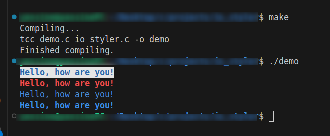

# IO Styler

IO Styler is a C library designed to enhance console applications by enabling styled text output directly to the console. This library uses ANSI escape codes to set text styles, foreground, and background colors.

## Features

-   **Foreground Colors:** Black, Red, Green, Yellow, Blue, Magenta, Cyan, White
-   **Background Colors:** Black, Red, Green, Yellow, Blue, Magenta, Cyan, White
-   **Text Styles:** Bold, Faint, Italic, Underline, Blink, Reverse

## Prerequisites

Make sure your console or terminal emulator supports ANSI escape codes. Most modern terminals do, but functionality may vary.

## Usage

Include `io_styler.h` in your C project to start using the library. The library provides two main functions:

-   `c_printf(char **styles, char *format, ...)`: Styled formatted printing.
-   `c_scanf(char **styles, char *format, ...)`: Styled formatted input (the styling applies to the prompt/display part only).

### Example

Here's a quick example on how to use `c_printf`:

```c
#include "io_styler.h"

int main() {
    char *message = "Hello, how are you!\n";
    c_printf((char* []) { BG_WHITE, FG_BLUE, ST_BOLD, NULL }, message);
    c_printf((char* []) { FG_RED, ST_BOLD, NULL }, message);
    c_printf((char* []) { FG_BLUE, NULL }, message);
    c_printf((char* []) { ST_BOLD, FG_RED, FG_BLUE, NULL }, message);
    return 0;
}
```

### output



### Installation

To use this library, compile the source code along with your project. Ensure that `io_styler.h` and `io_styler.c` are included in your project directory.

### Documentation

Refer to the ANSI escape code standards for more detailed information about the styling options: [ANSI Escape Codes.](https://gist.github.com/fnky/458719343aabd01cfb17a3a4f7296797)

### Contributing

Contributions to improve IO Styler are welcome. Please feel free to fork the repository, make changes, and submit pull requests
